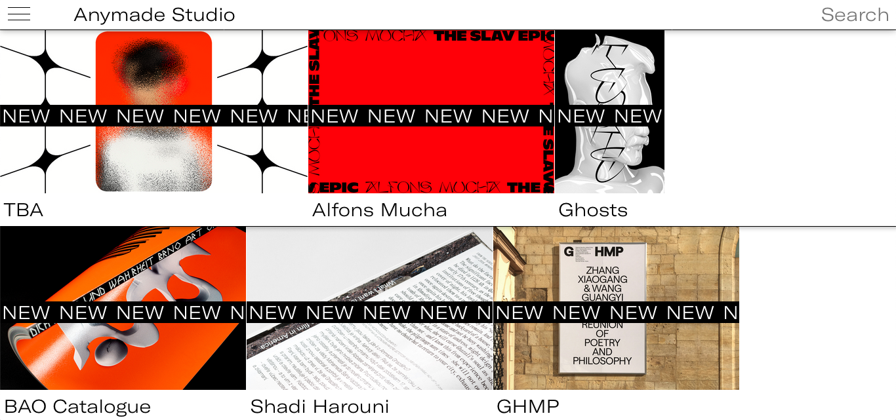

# Week 5

Because of the snow storm, I want to cover some simple things, and because we lose coding skills when we don't stay in practice, I've given you two short tutorials and 1 mini assignment based on this. I've also included a short writeup about a design studio and two of their projects and the site architecture approach to support it.

### In these notes

1. Case Study - Anymade Studio
 - how site architecture works with design
2. Tutorial - jQuery and a simple site
3. Tutorial - clock
 - the pure Javascript way of doing things instead of using jQuery
 - using setInterval to trigger a function to occur every specified number of milliseconds
4. Assignment - build on tutorial and build a better clock!

#### SNOW SECTION - not COVERED - the GitHub tutorials in this section will be covered next week!
- GitHub review
- GitHub pages
- using Glitch as a simplified GitHub playground

## Approaches to design and website architecture

### Case Study: Anymade Studio



This week we review the work of [Anymade Studio](http://anymadestudio.com/) from Prague, Czech Republic.

They use gradients, bright colors, beefy fonts and very clear menus. All demonstrate a very contemporary aesthetic. Their designs adhere to a grid, and are built of chunky blocks. They are responsive, mobile-first sites. They work at any size, with a clear  design and simple spatial organization that indicates the studio is designing with the phone in mind as the most important viewing platform.


- Check out the website for [Bastl Instruments](https://bastl-instruments.com/) (maker of Synthesizers). This is a simple website with a very contemporary design. How is it made? It features a CSS/Javascript sidebar, a large image at the top, and a large custom font.
- There is a very clear simple grid structure.


- [Startpoint Prize](http://www.startpointprize.eu/2018/) is the website of an annual European prize for art student graduates. Notice all the names and links. This site is a simple design, with text doing a lot of the work. Notice how they must have impeccable folder structure! Each Year at the top has a folder named with its own year number. Each of these have their own index.html file, and if you scroll down a little you see a list of names. Clicking on a name opens a page on that artist, with a short description and 5 - 10 photos of their work.

The site is structured:

```
startpointprize_website/
- index.html
- css/
  style.css
- js/
  jquery.js
  main.js
- 2018/
  - artists/
    - anastasia_afonina/
      index.html
    - katarina_barankova/
      index.html
    - david_bartos/
      index.html
    - another_artist_etc/
      index.html
- 2017/
  (NOT SHOWING FILES for 2017, BUT WORKS SAME AS 2018 folder...)
 - artist_images/
      anastasia_afonina1.jpg
      anastasia_afonina2.jpg
      katarina_barankova1.jpg
      katarina_barankova2.jpg
      david_bartos1.jpg
      david_bartos2.jpg
..etc..
```

Note: I am not showing every file of this site. I'm trying to demonstrate their overall basic file structure.

Also this is a huge website with dozens of artists and spanning multiple years, the site architecture is clear, which makes it easy to modify, add artists, correct mistakes, and to debug or change the code over time. This is good website architecture and demonstrates a way to work on creating large web projects.

## Project Tutorial 1: jQuery Review

In this back-to-basics section, this tutorial goes from the foundations: how does HTML, CSS and the jQuery Javascript library work together via the DOM? You'll build a simple site and write in jQuery, creating an *event listener* on an html button. When the button is clicked, our jQuery code then activates and changes the DOM so the page looks different. It does this by turning on and off certain css classes.

- Follow this [tutorial](https://googlecreativelab.github.io/coder-projects/projects/night_and_day/) to build a simple HTML/CSS/jQuery site that uses a button to toggle scenes, from Google Creative Lab.
  - This will serve as your full review of jQuery, the DOM, functions, if statements, and hooking up a button to take an action changing HTML/CSS


## Project Tutorial 2: Javascript approach

### Bonus: creating a timer that will trigger events

In this section, we are also working with the DOM but this time without the jQuery library.

- Follow this [tutorial](https://googlecreativelab.github.io/coder-projects/projects/digital_clock/) to build a Digital Clock with jQuery
- In Step 4 you'll see a block of code:

```
//plain Javascript version
var clockDiv = document.getElementById('clock');
```

This is a pure Javascript way of grabbing a HTML element to use later. If we don't use a Javascript library like jQuery we call that *plain vanilla* Javascript. If you wanted to do this exact same thing in jQuery instead, it would look like this:

```
//jQuery version
var clockDiv = $('#clock');
```

Later in the code in Step 4 of the tutorial, they set that specific element equal to something:

```
//plain Javascript version
clockDiv.innerText = hours + ":" + minutes + ":" + seconds;
```

FYI, here's how to do that in jQuery instead:

```
//equivalent jQuery version
clockDiv.text(hours+":"+minutes+":"+seconds);
```

There are pure Javascript versions of most other jQuery as well. If you are looking for tutorials or tips for certain web scripting questions online, you may see either jQuery or pure Javascript code so it's important you understand both ways to do things. Going forward, when working on your own projects, you may choose to use either regular (vanilla) Javascript or jQuery. I find it a tad simpler to write in jQuery but there is a recent trend toward writing in plain vanilla Javascript.


#### Setting a timer to do something at a set interval, using setInterval

In Step 7 of the tutorial, they demonstrate the use of setInterval.

When you learn CS at Purchase, your first language is often Processing, or now p5.js. In Processing, *setup()* runs once at the start, and *draw()* happens in a loop until your program exits.

Running your main code in a loop is a common need for most programmers. Javascript has a built in function call, ```setInterval(functionNameToCall, millisecondsToWait)``` that you can use to trigger a function to run every *x* number of milliseconds.

In the tutorial, they add this line of code to the program.


```
setInterval(displayTime, 1000);
```

This line uses setInterval. Every 1000 milliseconds the displayTime() function will run.

## Assignment - Build a Better Clock

- Follow the [tutorial](https://googlecreativelab.github.io/coder-projects/projects/digital_clock/) to build a clock. The tutorial gets you going, but it produces a pretty basic clock. When you complete the tutorial, modify and create new CSS and change the Javascript. Make it better, more beautiful, easy to read, more interesting or even a vastly different clock. (For example, if you wanted to change the clock, you could countdown a presidency, create a clock for a new country with its own timezone, create a clock that updates once a decade, a clock that shows images instead of the time, etc)
- Bonus points for making your clock responsive so that it looks good on your phone and/or digital watch!

#### Examples of other alternative clocks

For this assignment, you are welcome to stick with and build off this counting digital clock approach. The following are clocks that count in a more 'analog' style.

- [Human Clock](https://www.humanclock.com/) - features a photo of a different person every minute holding up the time
- A basic clock in [Binary](https://binary.onlineclock.net/)!
- My own version of a [Season Clock](http://leetusman.com/everyday/9/) that rotates once a year.
- [Polar Clock](http://blog.pixelbreaker.com/polarclock) - written in Flash
- [Worldometer](http://www.worldometers.info/) - not a clock but clock-like
- an [online implementation](https://jayasurian123.github.io/berlin-uhr/) of Berlin's famous [Mengenlehreuhr clock](https://www.futilitycloset.com/2017/01/17/the-mengenlehreuhr/)
